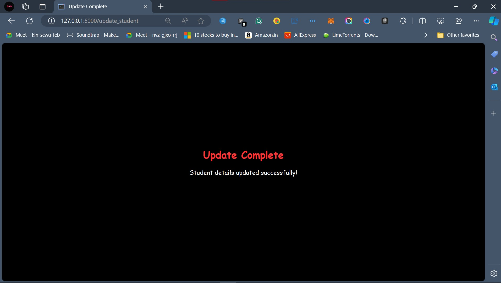

# Face detection-based alert system for student ID card verification using (Histogram of Oriented Gradients (HOG), You Only Look Once (YOLO), Simple Mail Transfer Protocol (SMTP))

## ABSTRACT

In the context of campus security and attendance tracking, this research proposes a comprehensive system that integrates facial recognition with YOLO (You Only Look Once) object detection to automate attendance monitoring and ensure compliance with ID card policies on college campuses. The system employs Histogram of Oriented Gradients (HOG) features along with a Support Vector Machine (SVM) classifier for real-time facial recognition, utilizing the `face_recognition` library. Furthermore, YOLO object detection is utilized to detect whether students are wearing their ID cards. If an ID card is not detected, an alert email is sent to the respective student, utilizing the Simple Mail Transfer Protocol (SMTP) for email notifications. The proposed system enhances campus security, ensures accurate attendance tracking, and helps enforce campus policies effectively, contributing to a safer and more secure learning environment. This research aims to provide colleges and universities with a reliable solution for ID card policy enforcement, attendance monitoring, and security enhancement.

## OBJECTIVES

The main objective of this project is to develop a system that combines facial recognition with YOLO object detection to automate attendance monitoring and enforce ID card policies on college campuses. By integrating these technologies, the system ensures accurate attendance tracking and enhances campus security by detecting non-compliance with ID card policies. The specific objectives include:

- Detect whether students are wearing their ID cards using YOLO object detection.

- Send alert emails to students if ID cards are not detected.

- Automate attendance monitoring using facial recognition.
  
  

## OVERVIEW

**1) Student Details Update:**

Student details such as name, registration number, and email ID are stored in a students.csv file.

**2)Face Image Data Collection and Model Training:**

Input images of students are captured with the student's name as filename and stored in a folder. A face recognition model is trained using the images from the folder to recognize faces.

**3) ID Card Dataset Annotation and YOLOv8 Model Training:**

An ID card dataset is collected and annotated using tools like Roboflow and VGG Image Annotator. The annotated dataset is used to train a YOLOv8 model for detecting ID cards.

**4) Real-time Face Recognition and Attendance Logging:**

Live video of faces is captured. The face is detected and sent to the trained face recognition model to recognize the student. Upon recognition, the time of the face detection is recorded.

**5) ID Card Detection and Attendance Logging:**

The face snip is sent to the YOLOv8 model to detect if the student is wearing an ID card. If an ID card is present, the time at which the ID card is detected is recorded. The attendance.csv file is updated with the student's name, time, and a boolean indicating if the ID card was worn (true/false).

**6) Attendance Record Management:**

If multiple instances of the same person are detected within 5 minutes, the same instance is updated in the attendance.csv file. Otherwise, a new instance is created.

**7) Alert Triggering for Missing ID Card:**

If the ID card is not worn, an alert message is triggered through the SMTP protocol.

The attendance.csv file is updated, and the alert message is written. The email of the student is retrieved from the students.csv file by matching the detected student's name with the names present.

**8) Email Notification:**

Finally, an email alert is sent to the student using SMTP to notify them about the absence of the ID card.

## SYSTEM ARCHITECTURE

 

There are 3 major architectures connected to each other in our design. The system starts by capturing streaming data from a webcam or another video source. Each frame of the video stream is processed in real-time to detect faces and objects.

**1) HOG + SVM ARCHITECTURE:**

**Image Scanning & Gradient Classification:** The first step involves scanning the input image using a sliding window. For each window, gradients of the image pixels are calculated. Gradients help in capturing the edges and shape of objects.

**Cell Histogram & Histogram Normalization:** Gradients within each cell of the window are used to construct a histogram. These histograms are then normalized to improve the invariance to changes in illumination and contrast.

**Collect HOG Features Over a Window:**

Histogram of Oriented Gradients (HOG) features are collected by combining histograms from multiple cells within the window. These features are stored as encodings and are used to classify and recognize the different faces in the face dataset.

**Linear SVM Classification:**

The collected HOG features are passed through a Linear Support Vector Machine (SVM) classifier. SVM classifier is trained to differentiate between faces and non-faces, and also to classify the imput face in the image stream into the different faces available in the face dataset.

**Scan the Next Detection Window:** The process continues by moving the detection window and repeating the above steps until the entire image is scanned.

Meanwhile the idcard dataset is annotated using Roboflow and sent to YOLOv8 for the training.

That person if find the name it take a snip of the window and send that image to the yolo model to check whether the data set is present or not.

**2) YOLOv8 ARCHITECTURE:**

**Feature Extraction:** The first stage extracts features from the input image using several convolutional layers. Convolutional layers apply a filter to the image, producing a feature map.

**Backbone:** The second stage consists of multiple residual blocks which are responsible for extracting higher-level features. Residual blocks are used to improve the accuracy and speed of training.

**Feature Pyramid Network (FPN):** FPN combines feature maps from different stages of

the backbone to create a feature pyramid with information at different scales. This allows the detector to detect objects of different sizes.

**Detection Heads:** The final stage consists of three detection heads, each predicting bounding boxes and probabilities for different size objects. Bounding boxes represent the location of an object in the image.

**Attendance Recording:** If a face is detected along with an ID card, the system updates the attendance.csv file with a timestamp. The name of the person is extracted from the image filename.

**Email Notification:** If an ID card is not detected, the system sends an email notification to the person. The recipient's email address is retrieved from the students.csv file by matching the name in the image filename.

**3) SMTP ARCHITECTURE:**

**Sender:**

**Sender Address Setup:** The system sets up the sender's email address.

**Send Mails Queue:** A queue is maintained to manage the sending of emails.

**Message Transfer Agent (MAT):** A Message Transfer Agent is responsible for sending emails. It establishes a TCP connection to the recipient's mail server on port 587.

**Receiver:**

**Receive Connection from MAT:** The receiver's mail server accepts connections from the Message Transfer Agent (MAT).

**User Mailboxes:** Mailboxes are set up to receive emails.

**Recipient’s Address Retrieval:** The system retrieves the recipient's email address from the students.csv file by matching the name extracted from the image filename.

**Attendance Update:** After sending the email, the attendance.csv file is updated with the attendance records.

## RESULTS

### Case 1: ID Card Present

When an ID card is present during the attendance recording process, the system successfully detects the face of the student, displaying their name on the screen. Upon ID card detection, "ID card present: True" is logged. Subsequently, the system updates the attendance.csv file with the student's name, timestamp, and "True" (indicating ID card presence).

_

### Case 2: ID Card Not Present

In instances where the ID card is not detected during attendance recording, the system still recognizes the student's face, displaying their name on the screen. However, "ID card present: False" is logged, indicating the absence of the ID card. The system then updates the attendance.csv file with the student's name, timestamp, and "False" (indicating ID card absence). Additionally, an email notification is sent to the respective student's email address, informing them about the absence of their ID card during the attendance recording process.

## FLASK APPLICATION

### START FLASK

### HOME PAGE

### UPDATE PAGE

### UPDATE COMPLETION

### DETAILS ADDED IN LIBREARY

### LIVE CHECK

### CAMERA RUNNING POPUP

### FINAL OUTPUT DATA

## CONCLUSION

The developed face recognition and attendance management system successfully recognizes faces in real-time video streams using the Histogram of Oriented Gradients (HOG) feature descriptor and a Support Vector Machine (SVM) classifier. Additionally, the system detects the presence of ID cards in the images using the YOLOv8 object detection model.

The system updates the attendance records by timestamping when each recognized face is detected, and if an ID card is not present during the attendance recording, an email notification is sent to the respective student's email address.

## FOR COMPLETE CODE

### CONTACT

MAIL:- sudanaveen4@gmail.com

linkidin:- sudanaveen4
